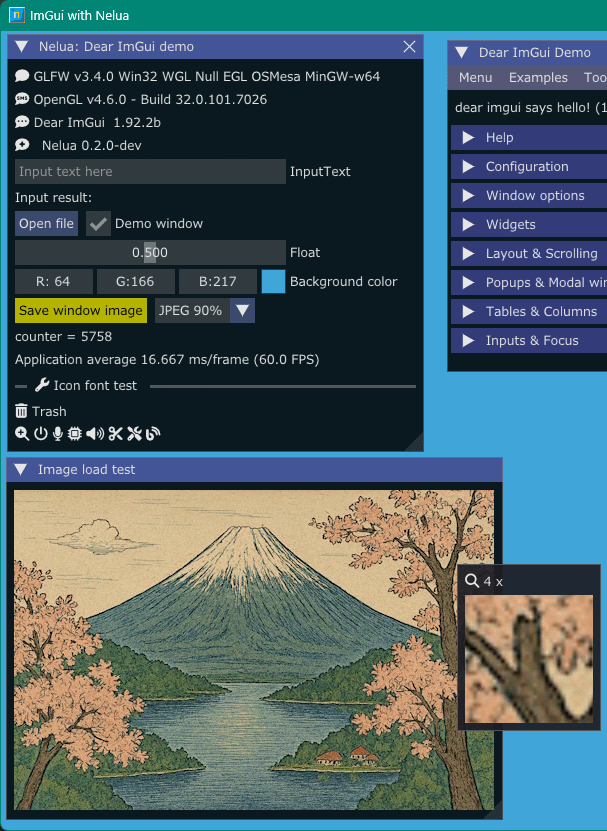

<!-- START doctoc generated TOC please keep comment here to allow auto update -->
<!-- DON'T EDIT THIS SECTION, INSTEAD RE-RUN doctoc TO UPDATE -->

- [NeluaImGui2](#neluaimgui2)
  - [Currently highly work in progress](#currently-highly-work-in-progress)
  - [Versions](#versions)
  - [Prerequisites](#prerequisites)
  - [Build and run](#build-and-run)
  - [Available libraries list at this moment](#available-libraries-list-at-this-moment)
  - [Examples](#examples)
    - [imGuiToggleDemo](#imguitoggledemo)
    - [imKnobsDemo](#imknobsdemo)
    - [imSpinnerDemo](#imspinnerdemo)
    - [imColorTextEditDemo](#imcolortexteditdemo)
    - [imGuizmoDemo](#imguizmodemo)
    - [imNodesDemo](#imnodesdemo)
    - [imFileDialogDemo](#imfiledialogdemo)
    - [iconFontViewer](#iconfontviewer)
    - [imPlotDemo](#implotdemo)
    - [imPlot3DDemo](#implot3ddemo)
    - [glfw_opengl3, sdl2_opengl3](#glfw_opengl3-sdl2_opengl3)
    - [glfw_opengl3_jp](#glfw_opengl3_jp)
  - [Update NeluaImGui2](#update-neluaimgui2)
  - [SDL2 / GLFW / STB headers for Nelua](#sdl2--glfw--stb-headers-for-nelua)
  - [My tools version](#my-tools-version)
  - [History](#history)
  - [Other ImGui / CImGui project](#other-imgui--cimgui-project)
  - [SDL game tutorial Platfromer](#sdl-game-tutorial-platfromer)

<!-- END doctoc generated TOC please keep comment here to allow auto update -->

### NeluaImGui2

 


#### Currently highly work in progress

---

This project aims to simply and easily build [Dear ImGui](https://github.com/ocornut/imgui) examples with **Nelua language** using [Dear_Bindings](https://github.com/dearimgui/dear_bindings) as first step.  
(Dear ImGui + [CImGui](https://github.com/cimgui/cimgui)) version is [NeluaImGui](https://github.com/dinau/NeluaImGui).

#### Versions

---

[DearBindings](https://github.com/dearimgui/dear_bindings): dear_bindings_v0.17_ImGui_v1.92.2b-docking  
[Dear ImGui](https://github.com/ocornut/imgui) version **1.92.2b** (2025/08)  


#### Prerequisites

---

- Install [MSys2/MinGW](https://www.msys2.org/) (Windows OS)
- Install [NeLua](https://nelua.io/installing/)
- Windows OS 10 or later
   1. Install libraries
   
      ```sh
      pacman -S mingw-w64-x86_64-{gcc,clang,glfw,pkgconf,SDL2,SDL2_image} make
      ```

- Linux: Ubuntu 24.04 / Debian13 families  
   1. Install libraries

      ```sh
      $ sudo apt install gcc clang lib{opengl-dev,gl1-mesa-dev,glfw3-dev,sdl2-dev} make
      ```

#### Build and run

---

1. Download this project.

   ```sh
   git clone https://github.com/dinau/neluaImGui2
   ```
1. Go to one of the examples folder for instance,

   ```sh
   cd neluaImGui2/examples/glfw_opengl3
   make run 
   ```

#### Available libraries list at this moment

---

Library name / C lang. wrapper

- [x] [ImGui](https://github.com/ocornut/imgui) / [Dear_Bindings](https://github.com/dinau/dear_bindings_build) (2025/09)
- [x] [ImPlot](https://github.com/epezent/implot) / [CImPlot](https://github.com/cimgui/cimplot) (2025/09)
- [x] [ImPlot3d](https://github.com/brenocq/implot3d) / [CImPlot3d](https://github.com/cimgui/cimplot3d) (2025/09)
- [x] [ImNodes](https://github.com/Nelarius/imnodes) / [CImNodes](https://github.com/cimgui/cimnodes) (2025/09)
- [x] [ImGuizmo](https://github.com/CedricGuillemet/ImGuizmo) / [CImGuizmo](https://github.com/cimgui/cimguizmo) (2025/09)
- [x] [ImGui-Knobs](https://github.com/altschuler/imgui-knobs) / [CImGui-Knobs](https://github.com/dinau/imguin/tree/main/src/imguin/private/cimgui-knobs) (2025/09)
- [x] [ImGuiFileDialog](https://github.com/aiekick/ImGuiFileDialog) / [CImGuiFileDialog](https://github.com/dinau/CImGuiFileDialog) (2025/09)
- [x] [ImGui_Toggle](https://github.com/cmdwtf/imgui_toggle) / [CimGui_Toggle](https://github.com/dinau/cimgui_toggle) (2025/09)
- [x] [ImSpinner](https://github.com/dalerank/imspinner) / [CImSpinner](https://github.com/dinau/cimspinner) (2025/09)
- [x] [ImGuiColorTextEdit](https://github.com/santaclose/ImGuiColorTextEdit) / [cimCTE](https://github.com/cimgui/cimCTE) (2025/09)


####  Examples

---


##### imGuiToggleDemo

---

[imGuiToggleDemo.nelua](examples/imGuiToggleDemo/imGuiToggleDemo.nelua) 


##### imKnobsDemo

---

[imKnobsDemo.nelua](examples/imKnobsDemo/imKnobsDemo.nelua) 


##### imSpinnerDemo

---

[imSpinnerDemo.nelua](examples/imSpinnerDemo/imSpinnerDemo.nelua) 


##### imColorTextEditDemo

---

[imColorTextEditDemo.nelua](examples/imColorTextEditDemo/imColorTextEditDemo.nelua) 


##### imGuizmoDemo

---

[imGuizmoDemo.nelua](examples/imGuizmoDemo/imGuizmoDemo.nelua) 


##### imNodesDemo

---

[imNodesDemo.nelua](examples/imNodesDemo/imNodesDemo.nelua) 


##### imFileDialogDemo

---

[imFileDialogDemo.nelua](examples/imFileDialogDemo/imFileDialogDemo.nelua) 


##### iconFontViewer

---

[iconFontViewer.nelua](examples/iconFontViewer/iconFontviewer.nelua) 

- [x] Magnifying glass  
- [x] Incremental search 
- [x] Static link [^dllWindows]

   

[^dllWindows]: Only Windows executables (without .dll dependencies)

##### imPlotDemo

---

[imPlotDemo.nelua](examples/imPlotDemo/imPlotDemo.nelua) 


##### imPlot3DDemo

---

Note: Use Clang compiler (see Makefile)

[imPlot3DDemo.nelua](examples/imPlot3DDemo/imPlot3DDemo.nelua) 


##### glfw_opengl3, sdl2_opengl3

---

[glfw_opengl3.nelua](examples/glfw_opengl3/glfw_opengl3.nelua), 
[sdl2_opengl3.nelua](examples/sdl2_opengl3/sdl2_opengl3.nelua)

- [x]  Icon fonts
- [x]  Image loading and saving [ **jpg, bmp, png, tga** ] format
- [x]  Magnifying glass  

   

##### glfw_opengl3_jp

---

Showing multibyte fonts(UTF-8, CJK fonts) and IME(Input method)

[glfw_opengl3_jp.nelua](examples/glfw_opengl3_jp/glfw_opengl3_jp.nelua) 


#### Update NeluaImGui2

---

```sh
make copylibs
make gen
```

See `./Makefile` and `libs/libs_hash/Makefile`


#### SDL2 / GLFW / STB headers for Nelua

---

These header files [libs/nelua/glfw](libs/nelua/glfw), [libs/nelua/sdl2](libs/nelua/sdl2), [libs/nelua/stb](libs/nelua/stb) have thankfully been copied form [nelua-decl libraries project](https://github.com/edubart/nelua-decl).


#### My tools version

---

- Nelua-0.2.0-dev
- Gcc.exe (Rev1, Built by MSYS2 project) 15.2.0)
- Clang version 20.1.8
- Git version 2.46.0.windows.1
- Make: GNU Make 4.4.1

#### History

---

- Started project at 2025/09 with NeLua-0.2.0-dev and ImGui/CImGui 1.92.2b inherited from [NeLuaImGui](https://github.com/dinau/neluaImGui) project.

#### Other ImGui / CImGui project

---

| Language             |          | Project                                                                                                                                         |
| -------------------: | :---:    | :----------------------------------------------------------------:                                                                              |
| **Lua**              | Script   | [LuaJITImGui](https://github.com/dinau/luajitImGui)                                                                                             |
| **NeLua**            | Compiler | [NeLuaImGui](https://github.com/dinau/neluaImGui), [NeLuaImGui2](https://github.com/dinau/neluaImGui2)                                          |
| **Nim**              | Compiler | [ImGuin](https://github.com/dinau/imguin), [Nimgl_test](https://github.com/dinau/nimgl_test), [Nim_implot](https://github.com/dinau/nim_implot) |
| **Python**           | Script   | [DearPyGui for 32bit WindowsOS Binary](https://github.com/dinau/DearPyGui32/tree/win32)                                                         |
| **Ruby**             | Script   | [igRuby_Examples](https://github.com/dinau/igruby_examples)                                                                                     |
| **Zig**, C lang.     | Compiler | [Dear_Bindings_Build](https://github.com/dinau/dear_bindings_build)                                                                             |
| **Zig**              | Compiler | [ImGuinZ](https://github.com/dinau/imguinz)                                                                                                     |

#### SDL game tutorial Platfromer

---


| Language             |          | SDL         | Project                                                                                                                                               |
| -------------------: | :---:    | :---:       | :----------------------------------------------------------------:                                                                                    |
| **LuaJIT**           | Script   | SDL2        | [LuaJIT-Platformer](https://github.com/dinau/luajit-platformer)
| **Nelua**            | Compiler | SDL2        | [NeLua-Platformer](https://github.com/dinau/nelua-platformer)
| **Nim**              | Compiler | SDL3 / SDL2 | [Nim-Platformer-sdl2](https://github.com/def-/nim-platformer)/ [Nim-Platformer-sdl3](https://github.com/dinau/sdl3_nim/tree/main/examples/platformer) |
| **Ruby**             | Script   | SDL3        | [Ruby-Platformer](https://github.com/dinau/ruby-platformer)                                                                                           |
| **Zig**              | Compiler | SDL3 / SDL2 | [Zig-Platformer](https://github.com/dinau/zig-platformer)                                                                                             |
